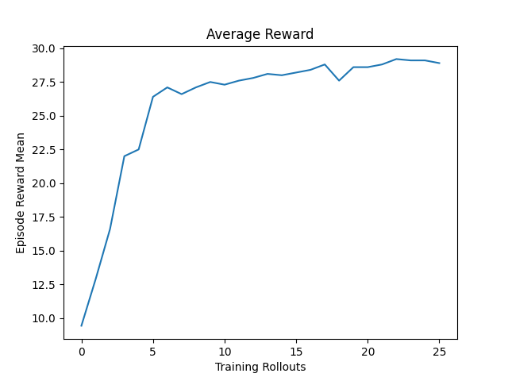
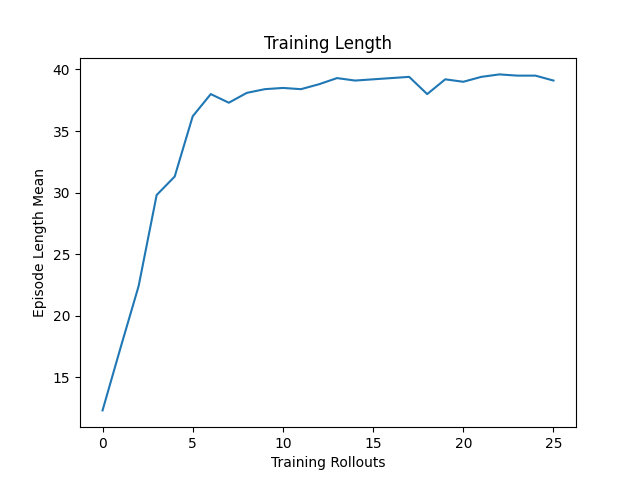

# RL in Self Driving Cars - SoC
Reinforcement Learning project in self driving cars as part of Seasons of Code (SoC) 2025 at IIT Bombay.

Weekly Tasks for the project are published at [https://github.com/Yash16Gupta/RL_in_SelfDrivingCars_SOC25](https://github.com/Yash16Gupta/RL_in_SelfDrivingCars_SOC25)

## Assignment 1 (Week 3)
### FrozenLake-v1
[Implementation](./assignment_1/frozenlake.py) of Tabular **Q-learning** with epsilon-greedy exploration

#### Additionally Implemented
[Taxi-v3](https://github.com/kadapallaNithin/mini_projects/blob/master/RL/q_learning/taxi.py) and
[MountainCar-v0](https://github.com/kadapallaNithin/mini_projects/blob/master/RL/q_learning/MountainCar-v0/README.md)

### Pendulum-v1

#### Learning Path and Additionally Implemented
[Detailed Learning Path](./assignment_1/learning_path.md)

[REINFORCE]()
## [Assignment 2](./assignment_2/README.md) (Week 5)
[Implementation](./assignment_2/Assignment2.py) of a **Pure Pursuit Controller** for a car-like robot to follow a predefined path, using a kinematic bicycle
model. The implementation includes a **PID controller** for speed regulation.

[Mentor Reference](https://github.com/AtsushiSakai/PythonRobotics/blob/master/PathTracking/pure_pursuit/pure_pursuit.py)

## Final Project
- The Proximal Policy Optimization (**PPO**) algorithm which is one of the **Deep Reinforcement Learning** algorithms is used to train an autonomous driving agent in the `highway-env` simulation environment.

- The Stable-Baselines3 package is used for the implementation of the PPO algorithm
- Following is a sample output of an iteration.
```
---------------------------------
| rollout/           |          |
|    ep_len_mean     | 39.3     |
|    ep_rew_mean     | 28.1     |
| time/              |          |
|    fps             | 10       |
|    iterations      | 1        |
|    time_elapsed    | 1586     |
|    total_timesteps | 16384    |
---------------------------------
```

- It is observed that the average return increased steadily showing the stability of the PPO algorithm. Also the average length of each episode also increased almost parallel to the reward.

- In the testing, it is observed that the agent learned to avoid collisions in 4 out of 5
episodes and got about 29 as reward in each of them. Despite changing the settings of the
environment the agent seems to get almost the same performance. Changed settings are
as follows:
```python
env.unwrapped.config["vehicles_count"] = 30
env.unwrapped.config["lanes_count"] = 3
env.reset()
```

Following graphs of `ep_rew_mean` and `ep_len_mean` respectively were observed.

