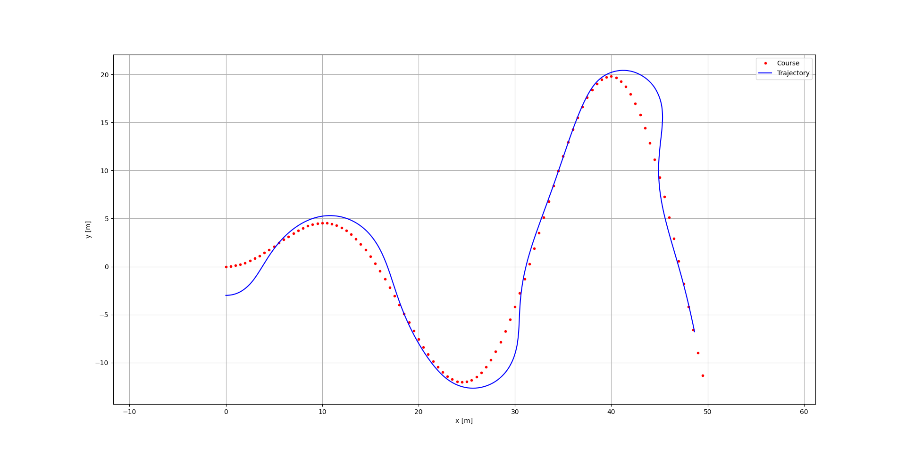
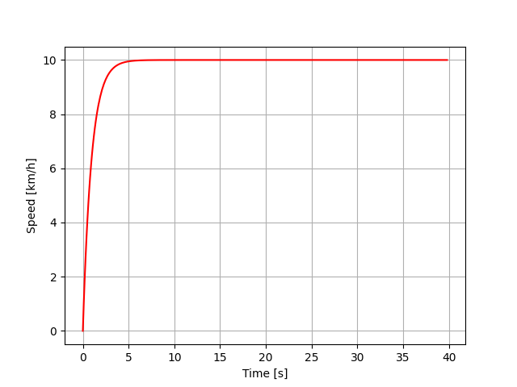

# Pure Pursuit Controller
[Implementation](./Assignment2.py) of a **Pure Pursuit Controller** for a car-like robot to follow a predefined path, using a kinematic bicycle
model. The implementation includes a **PID controller** for speed regulation.

## Video Demo

## Trajectory

## Speed vs Time

